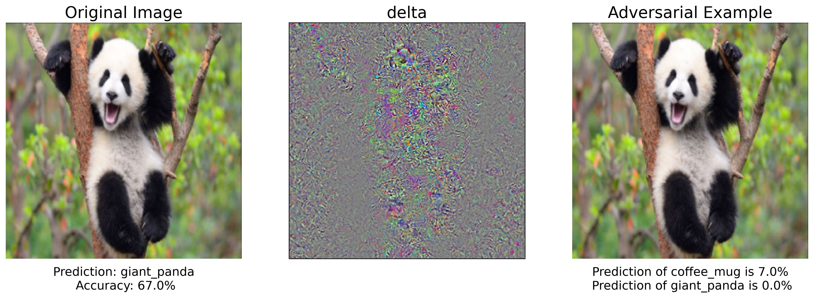
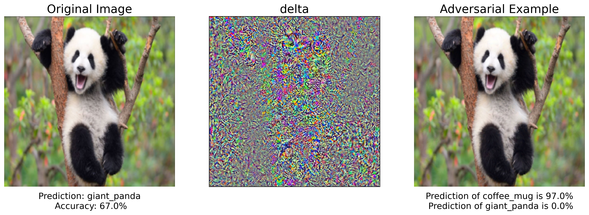
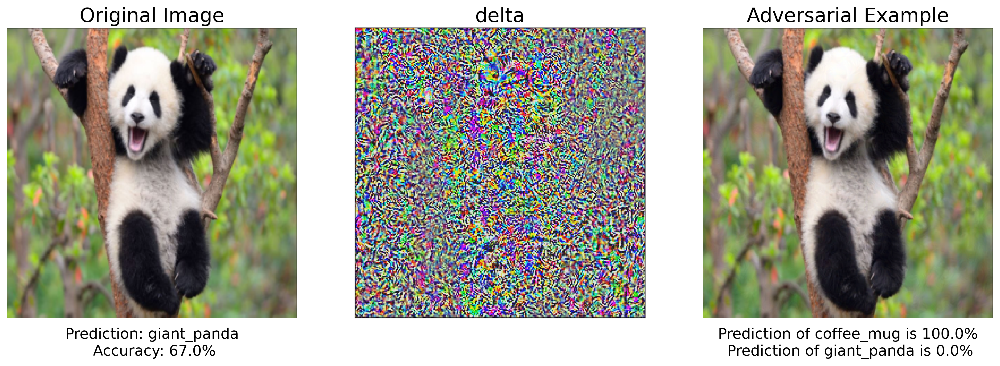

# Fast-Gradient-Signed-Method-FGSM
One of the first and most popular adversarial attacks to date is referred to as the Fast Gradient Sign Attack (FGSM) and is described by Goodfellow et. al. in Explaining and Harnessing Adversarial Examples. The attack is remarkably powerful, and yet intuitive. It is designed to attack neural networks by leveraging the way they learn, gradients. The idea is simple, rather than working to minimize the loss by adjusting the weights based on the backpropagated gradients, the attack adjusts the input data to maximize the loss based on the same backpropagated gradients. In other words, the attack uses the gradient of the loss w.r.t the input data, then adjusts the input data to maximize the loss.

# Pre-requisites
- torch: 1.5.0+cu101 (Just the CPU version is more than enough)
- matplotlib: 3.2.1
- numpy: 1.18.4
- PIL
- json

# Inputs
- image: The input image to which the noise is added
- epsilons:  List of epsilon values to use for the run.  Also, intuitively we would expect the larger the epsilon, the more noticeable the perturbations but the more effective the attack in terms of degrading model accuracy. Since the data range here is [0,1], no epsilon value should exceed 1.
- pretrained model: pytorch already has the pretrained models, I have used them(Alexnet)

# Results

# Fast-Gradient-Signed-Method-FGSM (targeted attack)
- This is a technique where we make the image classified as virtually any class we desire. This is know as "Targeted adversarial attack". The only difference is that instead of trying to just maximize the loss of the correct class, we maximize the loss of the correct class while also minimizing the loss of the target class.

# Inputs
- image: The input image to which the noise is added
- epsilon value
- learning rate for the optimizer(we are optimizing the perturbations on the image)
- pretrained model: pytorch already has the pretrained models, I have used them(Alexnet)
- required class whose accuracy we want to increase on an image

# Results
- We can see that the accuracy of the required class(coffee-mug) increases while the gaint-panda decreases

